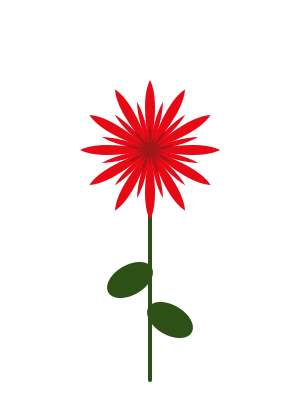
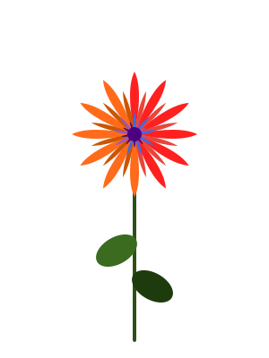
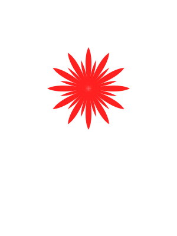
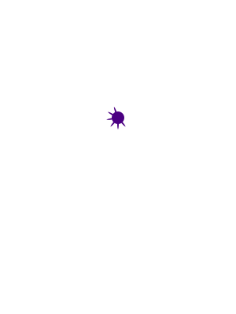

# SVG Color Splitter

Splits a multi-color SVG into separate SVG files by fill/stroke color, for multi-color 3D printing.

Designed for workflows where you export a single SVG from Illustrator (or similar) and need per-color files to import into Bambu Studio or another slicer. Each output file preserves the original `viewBox` and dimensions, so the layers align without manual repositioning.

## Setup

```bash
python3 -m venv .venv
source .venv/bin/activate
pip install -r requirements.txt
```

You'll need to run `source .venv/bin/activate` each time you open a new terminal.

## Usage

```bash
python3 split_svg_by_color.py <input.svg> [--outdir <directory>] [--max-colors <N>]
```

### Example

Try it on the included example:

```bash
python3 split_svg_by_color.py examples/simple/3_color_flower.svg --outdir examples/simple/output
```

**Input** — `examples/simple/3_color_flower.svg`, a single SVG with three colors:



**Output** — one file per color in `examples/simple/output/`, all sharing the same bounding box so layers align:

| `_red.svg` | `_firebrick.svg` | `_darkgreen.svg` |
|:-:|:-:|:-:|
|  |  |  |

Use `--outdir` to write to a different folder:

```bash
python3 split_svg_by_color.py my_design.svg --outdir ./split
```

Use `--max-colors` to limit the number of output files. The most visually similar colors are merged first. Merged shapes are recolored to a single unified color per file:

```bash
python3 split_svg_by_color.py examples/max-colors/10_color_flower.svg --outdir examples/max-colors/output --max-colors 4
```

**Input** — a 10-color flower (reds/oranges for outer petals, blues/purples for inner, greens for stem):



**Output** — 10 colors merged down to 4:

|                                         `_red.svg`                                         |                                            `_royalblue.svg`                                             |                                          `_indigo.svg`                                           |                                            `_darkgreen.svg`                                             |
| :----------------------------------------------------------------------------------------: | :-----------------------------------------------------------------------------------------------------: | :----------------------------------------------------------------------------------------------: | :-----------------------------------------------------------------------------------------------------: |
|  |  |  |  |

## Details

- Handles `<path>`, `<rect>`, `<circle>`, `<ellipse>`, `<polygon>`, `<polyline>`, `<line>`, `<text>`, `<tspan>`, and `<use>` elements
- Groups shapes by fill color; stroke-only shapes (e.g. `fill="none" stroke="green"`) fall back to stroke color so they aren't lost
- Resolves fill and stroke from attributes, inline `style=`, and inherited values from parent `<g>` groups
- Normalizes equivalent color formats (`#000`, `black`, `rgb(0,0,0)` all group together)
- Labels output files with the nearest CSS3 color name (e.g. `#fe0100` becomes `_red`, not `_fe0100`)
- Shapes with no visible fill or stroke are excluded
- Includes registration marks for slicer alignment (see below)

## Registration marks

Slicers like Bambu Studio ignore the `viewBox`, `width`, and `height` attributes on an SVG. Instead they compute a bounding box from the actual geometry and center it. This means if you import two split files separately, each one gets centered based on its own shapes — and they no longer line up.

To fix this, each output file includes two tiny circles (radius 0.01 SVG units) placed at opposite corners of the original viewBox. Because every file gets marks at the same positions, every file has the same bounding box, so the slicer centers them identically and the layers align. The marks are filled with the same color as the file's shapes so they don't introduce a new color.

## Caveats

- **Stroke-only shapes won't print as geometry.** Slicers work with filled/closed paths. If your SVG has stroke-only elements (like a line drawn with `stroke` but `fill="none"`), the splitter keeps them in the correct color file, but you'll need to convert strokes to filled paths before the slicer can use them. In Illustrator: Object > Path > Outline Stroke. In Inkscape: Path > Stroke to Path.
- **CSS `<style>` blocks and classes are not supported.** The splitter reads `fill`/`stroke` from element attributes and inline `style="..."` only. If your SVG uses `<style>.cls-1 { fill: red }</style>`, those styles won't be detected. Flatten styles to inline attributes before splitting (Illustrator does this by default on SVG export with "Inline Style" selected).
- **Gradients and patterns are not handled.** Shapes with `fill="url(#gradient)"` won't match a solid color and will be grouped under a fallback label.
- **Two near-identical colors produce separate files.** `#ff0000` and `#fe0100` are normalized to different hex values, so they get separate output files (even though both are labelled `_red`). Use `--max-colors` to merge them automatically, or clean them up in the source SVG.
- **Registration marks add two extra shapes per file.** At radius 0.01 they're invisible at any reasonable print scale, but they're technically in the SVG. If you need clean output without them, you can remove them manually or modify the script.

## Testing

```bash
pip install pytest
pytest tests/
```

Test fixtures (real `.svg` files) live in `tests/fixtures/`.

## Requirements

Python 3.10+, [webcolors](https://pypi.org/project/webcolors/)

## License

MIT
